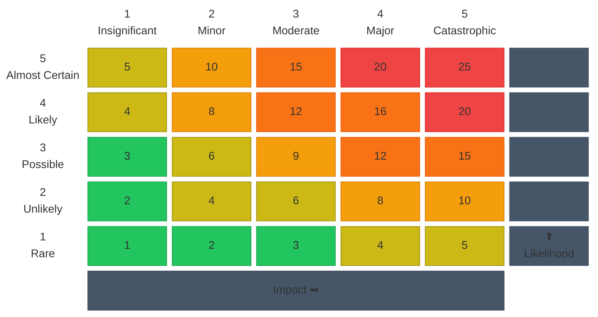

# Risk Register and Mitigation Plan

> **Template:** Copy this document into your project and adapt each section to your domain. Sections marked with "Adapt:" have guidance on what to change. Remove this callout and all "Adapt:" notes once you've customized the document.

## 1. Purpose and Scope

{Describe what system or project this register covers. Define the boundary explicitly.}

**Audience:** {Who reads this? Engineering team, leadership, auditors, external stakeholders.}

**Phase Note:** {Is this a discovery-phase preliminary assessment, or a mature register with operational data? State this so readers calibrate their confidence in the scores.}

## 2. Risk Management Methodology

### Approach

Qualitative risk assessment using a **5x5 likelihood-impact matrix**, aligned with ISO 31000:2018 principles.

### Risk Assessment Formula

Each risk is scored twice:

- **Inherent risk** = Likelihood x Impact (before any controls)
- **Residual risk** = Likelihood x Impact (after planned controls are applied)

The gap between inherent and residual risk makes the effectiveness of mitigations visible and auditable.

## 3. Likelihood and Impact Scales

### Likelihood

| Score | Label | Definition |
|-------|-------|------------|
| 1 | Rare | < 5% probability |
| 2 | Unlikely | 5-20%; has occurred in similar systems but conditions differ |
| 3 | Possible | 20-50%; plausible given current architecture |
| 4 | Likely | 50-80%; expected without additional controls |
| 5 | Almost Certain | > 80%; has occurred in comparable systems |

### Impact

> **Adapt:** Rewrite these definitions for your domain. The examples below are for infrastructure/protocol projects. A SaaS product might use "revenue impact" and "user-facing degradation" instead.

| Score | Label | Definition |
|-------|-------|------------|
| 1 | Insignificant | No financial loss; minor delay; self-correcting |
| 2 | Minor | Limited financial impact; recoverable within hours; no user impact |
| 3 | Moderate | Significant operational disruption; partial service degradation; reputation damage |
| 4 | Major | Material financial loss; extended downtime; potential data or fund exposure |
| 5 | Catastrophic | Total loss of critical assets; unrecoverable compromise; project-ending event |

### Severity Bands

| Score Range | Severity | Required Action |
|-------------|----------|-----------------|
| 1-3 | Low | Accept; monitor with documented rationale |
| 4-6 | Low-Medium | Monitor; review periodically |
| 8-10 | Medium | Active mitigation required; assign owner and timeline |
| 12-16 | High | Immediate mitigation plan; escalate to project leadership |
| 20-25 | Critical | Must resolve before launch; potential blocker |

## 4. Risk Appetite and Tolerance

> **Adapt:** Set the maximum acceptable residual severity per category based on your project's risk tolerance. The defaults below cap everything at Medium.

| Category | Maximum Acceptable Residual Severity | Notes |
|----------|--------------------------------------|-------|
| Security (SEC) | Medium (10 or below) | No unmitigated High or Critical security risks at launch |
| Operational (OPS) | Medium (10 or below) | Disruptions must be recoverable within defined SLAs |
| Protocol / Technical (PRO) | Medium (10 or below) | Risks above Medium require design changes before launch |
| Governance (GOV) | Medium (10 or below) | Governance gaps must be resolved before production |

## 5. Risk Taxonomy

> **Adapt:** Add, remove, or rename categories to match your project domain. The codes are used as prefixes in risk IDs (e.g., `R-SEC-001`).

### SEC: Security Risks

Threats to key material confidentiality, access control, cryptographic soundness, and contract integrity.

### OPS: Operational Risks

Infrastructure failures, procedural errors, monitoring gaps, and incident response readiness.

### PRO: Protocol / Technical Risks

Design-level vulnerabilities, integration assumptions, performance bottlenecks, and compatibility issues.

### GOV: Governance Risks

Decision authority gaps, collusion vectors, compliance requirements, and decentralization concerns.

## 6. Risk Register

Each risk has a unique ID: `R-{CATEGORY}-{NNN}`.

> **Adapt:** Create one table per category. Add or remove columns as needed. The "Related Docs" column is useful for linking to ADRs, specs, or other artifacts.

### SEC: Security Risks

| ID | Risk | Description | Inherent Likelihood | Inherent Impact | Inherent Score | Existing Controls | Mitigation Strategy | Control Type | Residual Likelihood | Residual Impact | Residual Score | Owner | Status | Related Docs |
|----|------|-------------|---------------------|-----------------|----------------|-------------------|---------------------|--------------|---------------------|-----------------|----------------|-------|--------|--------------|
| `R-SEC-001` | {Risk title} | {What could go wrong} | {1-5} | {1-5} | {L x I} | {What's already in place} | {Avoid/Reduce/Transfer/Accept} | {Preventive/Detective/Corrective} | {1-5} | {1-5} | {L x I} | {Name} | {Open/In Progress/Closed} | {Links} |

### OPS: Operational Risks

| ID | Risk | Description | Inherent Likelihood | Inherent Impact | Inherent Score | Existing Controls | Mitigation Strategy | Control Type | Residual Likelihood | Residual Impact | Residual Score | Owner | Status | Related Docs |
|----|------|-------------|---------------------|-----------------|----------------|-------------------|---------------------|--------------|---------------------|-----------------|----------------|-------|--------|--------------|
| `R-OPS-001` | {Risk title} | {What could go wrong} | {1-5} | {1-5} | {L x I} | {What's already in place} | {Avoid/Reduce/Transfer/Accept} | {Preventive/Detective/Corrective} | {1-5} | {1-5} | {L x I} | {Name} | {Open/In Progress/Closed} | {Links} |

### PRO: Protocol / Technical Risks

| ID | Risk | Description | Inherent Likelihood | Inherent Impact | Inherent Score | Existing Controls | Mitigation Strategy | Control Type | Residual Likelihood | Residual Impact | Residual Score | Owner | Status | Related Docs |
|----|------|-------------|---------------------|-----------------|----------------|-------------------|---------------------|--------------|---------------------|-----------------|----------------|-------|--------|--------------|
| `R-PRO-001` | {Risk title} | {What could go wrong} | {1-5} | {1-5} | {L x I} | {What's already in place} | {Avoid/Reduce/Transfer/Accept} | {Preventive/Detective/Corrective} | {1-5} | {1-5} | {L x I} | {Name} | {Open/In Progress/Closed} | {Links} |

### GOV: Governance Risks

| ID | Risk | Description | Inherent Likelihood | Inherent Impact | Inherent Score | Existing Controls | Mitigation Strategy | Control Type | Residual Likelihood | Residual Impact | Residual Score | Owner | Status | Related Docs |
|----|------|-------------|---------------------|-----------------|----------------|-------------------|---------------------|--------------|---------------------|-----------------|----------------|-------|--------|--------------|
| `R-GOV-001` | {Risk title} | {What could go wrong} | {1-5} | {1-5} | {L x I} | {What's already in place} | {Avoid/Reduce/Transfer/Accept} | {Preventive/Detective/Corrective} | {1-5} | {1-5} | {L x I} | {Name} | {Open/In Progress/Closed} | {Links} |

## 7. Mitigation Plan

### Control Types

| Type | When It Acts | Purpose | Example |
|------|-------------|---------|---------|
| **Preventive** | Before the event | Stop the risk from materializing | Access controls, audits, input validation |
| **Detective** | During / immediately after | Detect that a risk event has occurred | Monitoring, alerting, anomaly detection |
| **Corrective** | After the event | Limit damage and restore operation | Incident response, rollback, emergency pause |

### Response Strategy Types

| Strategy | When to Use |
|----------|-------------|
| **Avoid** | Eliminate the risk by changing the design |
| **Reduce** | Lower likelihood or impact through controls |
| **Transfer** | Shift the risk to a third party (audits, insurance, bug bounties) |
| **Accept** | Acknowledge and monitor; appropriate for low-severity risks |

### Detailed Mitigation Plans

Detailed plans are provided for all risks with an inherent score of 12 or above (High severity). Medium and lower risks are tracked in the risk register with mitigation strategies noted inline.

> **Adapt:** Copy the block below for each High/Critical risk. Remove the example once you've added real entries.

---

| R-XXX-NNN: {Risk title} |
|:--|
| **Risk:** {What could go wrong.} |
| **Inherent Score:** {L} x {I} = {Score} ({Severity}) |
| **Target Residual Score:** {L} x {I} = {Score} ({Severity}) |

**Preventive Controls:**

- [ ] {Control description} (owner: {Name})

**Detective Controls:**

- [ ] {Control description} (owner: {Name})

**Corrective Controls:**

- [ ] {Control description} (owner: {Name})

**Acceptance Criteria:** {What must be true for this risk to be considered mitigated.}

---

## 8. Roles and Responsibilities

> **Adapt:** Map these roles to actual people or teams in your project.

| Role | Responsibility |
|------|---------------|
| **Risk Owner** | Keeps the risk entry current; implements or oversees mitigation; reports status; escalates if residual risk exceeds appetite |
| **Project Team** | Assigns risk owners; ensures mitigations are resourced; reviews register regularly |
| **Leadership** | Sets risk appetite; approves acceptance of high/critical residual risks |

## 9. Review Cadence and Governance

> **Adapt:** Adjust frequencies based on your project phase and team size.

| Activity | Frequency | Participants |
|----------|-----------|--------------|
| Full register review | Quarterly | All risk owners + project leadership |
| High/Critical risk check | Monthly | Risk owners for high/critical items |
| Event-triggered update | As needed | Triggered by incidents, architecture changes, or new threats |
| Risk owner status update | Monthly | Each risk owner updates their entries |
| Risk appetite review | Quarterly | Leadership |

### Escalation Path

1. **Risk Owner** identifies risk score exceeds appetite
2. **Project Team** reviews and confirms
3. **Leadership** formally accepts or requires additional mitigation

### Change History

This document is version-controlled. All changes are tracked via git history.
